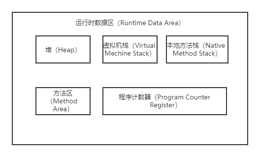
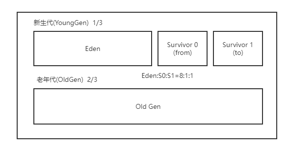

##### 类装载子系统

1. 加载：通过类的全限定名获取字节码文件，以二进制流的方式加载字节码文件，在内存中生成一个Class对象。
2. 链接：
    - 验证：验证当前字节码文件是否符合虚拟机规范，包含文件格式验证、元数据验证、字节码验证、符号引用验证。
    - 准备：为类变量分配内存并设置默认初始值，final修饰的变量在编译时赋值，实例变量在堆上分配。
    - 解析：将常量池内符号引用转换为直接引用。
3. 初始化：执行类的构造器方法clinit()，按顺序执行类变量的赋值操作和静态代码块中的内容。

##### 类加载器

1. 引导类加载器：使用C/C++语言实现，用于加载包名为java、javax、sun等开头的核心类
2. 扩展类加载器：间接继承自ClassLoader，用于加载jre/lib/ext目录下的类
3. 系统类加载器：间接继承自ClassLoader，用于加载用户自己编写的类

##### 双亲委派机制

- 原理：当一个类加载器收到了类加载请求，他自己不会先去加载，而是把这个请求委托给父加载器去加载，依次向上委托直至引导类加载器；当父加载器可以完成加载时直接返回成功，当父加载器无法完成加载任务时，子加载器才会尝试自己加载
- 优势：避免类的重复加载；防止核心API被篡改。

> 判断两个Class对象为同一个类的条件：

1. 类的全限定名(包括包名)必须一致
2. 加载类的ClassLoader实例对象必须相同

##### 运行时数据区

1. 程序计数器：存储即将执行的下一条指令的地址，保证程序在进行线程切换后能顺利地往下执行
2. 虚拟机栈：每个线程都会创建一个虚拟机栈，其中包含多个栈帧，每个栈帧对应着一次方法调用，方法调用时入栈，方法执行完出栈
3. 本地方法栈：线程私有，管理本地方法的调用
4. 堆空间：线程共享，对象进行内存分配的空间，是垃圾回收的重点区域；TLAB线程本地分配缓冲区用以提高并发性能；-Xms10m -Xmx10M；将初始内存和最大内存设置相同避免进行频繁的扩缩容带来系统性能的损耗
5. 方法区：属于堆外空间，使用直接内存，存放类型信息、运行时常量池、静态变量、代码缓存等，存在垃圾回收回废弃的常量和不再使用的类型

##### 栈帧

1. 局部变量表：以数字形式存储方法参数和定义在方法体内的局部变量，基本单位为Slot(变量槽)， 32位类型占一个基本单位，64位类型(long,double)占两个，实例方法第一个变量槽存放的是this对象
   当局部变量超过其作用域，之后声明的变量可以复用槽以节省资源
2. 操作数栈：在方法执行过程中，根据字节码指令，往栈中写入数据或提取数据 用于保存计算过程的中间结果，作为计算过程中变量的临时存储空间，32位类型占一个栈单位深度，64位占两个。
3. 动态链接：指向运行时常量池中该帧所属方法的引用，将符号引用转换为调用方法的直接引用
4. 方法返回地址：存放调用该方法的程序计数器的值，在方法调用完成后回到被调用的位置。

##### 堆空间

1. 新生代：创建新对象的内存分配空间
    - eden：对象第一次创建时分配在此区域
    - s0：内存复制时的区域，移动次数超过阈值(15次)则移动至老年代
    - s1：也称from/to区，只有一块区域可用
2. 老年代：长期存活的对象内存分配的空间

##### 堆内存分配的过程

1. 新创建的对象先放到新生代Eden区
2. Eden区满后触发Minor GC后，将新对象放在Eden区
3. 将Eden区剩余的存活对象移动至幸存者区
4. 多次(15次)Minor GC仍存活的对象将晋升至老年代
5. 超过Eden或者S0、S1最大内存的大对象直接放到老年代

##### 堆内存分配优化

1. 栈上分配：经过逃逸分析后，某个对象的作用域范围在方法内部，则可以将该对象分配在栈上
2. 同步省略：某个对象只能被一个线程访问到，该对象的同步操作可以省略
3. 标量替换：经过逃逸分析后，可以将对象替换成其属性值的标量，直接分配在栈帧的局部变量表

##### 对象创建的步骤

1. 判断类是否加载、链接、初始化，如没有则先进行类的加载
2. 为对象分配内存，计算对象占用空间大小
3. 处理并发安全问题：TLAB分配，区域加锁保证线程安全
4. 初始化分配到的空间，初始化默认赋值
5. 设置对象的对象头，存储对象的类元信息、HashCode、GC信息、锁信息
6. 执行init方法进行初始化，进行显式赋值

##### 执行引擎

1. 解释器：逐行解释执行，快速响应，保证执行效率
2. 即时编译器：将热点代码翻译成机器指令并缓存，保证执行性能
3. 垃圾回收器：进行垃圾回收，暂停用户线程

##### StringTable

1. 字符串存储位置：使用常量(final)字符串拼接存放在常量池中(编译器优化)；使用变量拼接的字符串存在在堆中(StringBuilder.toString)
2. 调用intern方法，返回该字符串在常量池中的引用，没有则创建，创建前先检查堆空间有无该字符串对象，有则直接使用该对象的引用
3. 字符串拼接时调用StringBuilder.toString方法底层调用了new String()，此时不会在常量池中创建对象

> new String("ab")会创建几个对象

1. 常量池中一个"ab"对象
2. 堆空间中一个String对象

##### 垃圾回收类型

1. Minor GC:主要回收新生代Eden区和S0/S1区,Eden区满了以后触发
2. Major GC：主要回收老年代，只有CMS GC才有
3. Full GC：同时回收整个堆空间和方法区，老年代或者方法区空间不足触发

##### 垃圾回收标记阶段算法

1. 引用计数算法：每个对象保存一个引用计数属性，用于记录对象被引用的次数。每被引用一次，计数器加一，当引用失效时，计数器减一，当引用计数器为零则判定为垃圾
    - 优点：实现简单，垃圾对象便于识别；判定效率高，回收没有延迟
    - 缺点：增加了存储空间和时间开销，无法处理循环引用的问题

2. 可达性分析算法：搜索被根对象集合所连接的目标对象是否可达，如果目标没有任何引用链相连，则该对象被标记为垃圾，否则标记为存活对象。 根对象集合包含了虚拟机栈和本地方法栈中引用的对象、方法区中静态属性和常量引用的对象、同步锁持有的对象等
    - 优点：解决了循环引用的问题
    - 缺点：会暂停用户线程

##### 垃圾回收清除阶段算法

1. 标记清除算法：从引用根节点开始遍历，标记所有被引用的对象，在对象头中记录为可达对象，从堆内存从头到尾进行线性遍历，发现某个对象没有标记为可达对象则将其回收放入空闲列表
    - 优点：实现简单
    - 缺点：效率不高；会暂用户线程；产生内存碎片，需要维护空闲列表
2. 复制算法：将内存分为两块，每次只使用其中一块，进行垃圾回收时将使用内存中的存活对象复制到另一块内存中并修改引用地址，然后清除使用内存中的所有对象，交替使用两块内存。
    - 优点：过程简单，运行高效；不会产生内存碎片
    - 缺点：内存利用率低；当存活对象较多时效率较低
3. 标记压缩算法：从根节点标记所有被引用的存活对象，将所有的存活对象按顺序排放压缩到内存的一端，清理边界外面的所有空间
    - 优点：内存利用率高；解决内存碎片问题，只需维护一个内存起始地址
    - 缺点：效率略低；需要移动对象，修改对象引用地址

> 内存溢出与内存泄漏

- 内存溢出：没有空闲内存，并且垃圾回收器也无法提供更多内存
- 内存泄漏：不再被使用的内存无法正确的被回收，最终导致内存溢出

> 强、软、弱、虚四种引用有什么区别

- 强引用：只要引用关系存在，垃圾回收器就不会回收该对象(不回收)
- 软引用：在发生内存溢出之前，可将这些对象进行二次回收(不足才回收)
- 弱引用：无论空间是否足够，垃圾回收器都会回收该对象(发现即回收)
- 虚引用：不影响GC，只能在这个对象被回收时收到一个通知(回收通知)

##### 分代收集

| | 串行垃圾回收 | 并行行垃圾回收 | 并发垃圾回收 |  
| :---: | :---: | :---: | :---: |
| 新生代 | Serial GC | Parallel GC | ParNew GC|
| 老年代 | Serial Old Gc | Parallel Old GC | CMS GC |

##### 垃圾回收器

1. Serial GC：采用复制算法，串行回收，STW机制
3. ParNew GC：采用复制算法，并行回收，STW机制
4. Parallel GC：采用复制算法，并行回收，STW机制，吞吐量优先
2. Serial Old GC：采用标记压缩算法。串行回收，STW机制
5. Parallel Old GC：采用标记压缩算法，并行回收，STW机制
6. CMS GC：采用标记清除算法，并发回收，STW机制，低延迟优先
7. G1 GC：采用分区复制、标记压缩算法，并发回收，STW机制，低延迟优先
8. 串行->并行；分代->分区；高吞吐->低延迟